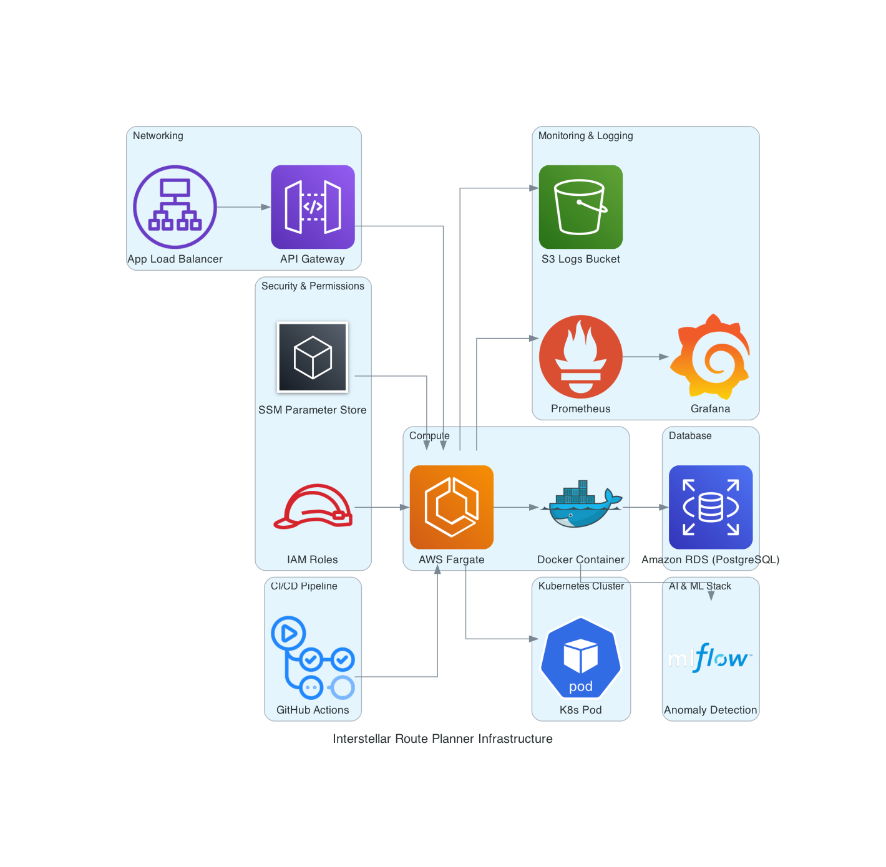

# Interstellar Route Planner 🚀

AI-powered route optimization and anomaly detection system designed with full-stack observability, modular deployment, and cloud-native architecture. This project integrates FastAPI, Docker, Terraform, AWS services, and monitoring via Prometheus and Grafana.

---

## 🌐 Live Endpoint

**Application Base URL:**  
http://interstellar-alb-1155191774.us-east-1.elb.amazonaws.com

- **Swagger Docs**: `/docs`
- **Prometheus Metrics**: `/metrics`

---

## 📦 Features

- 🚀 AI Anomaly Detection (IsolationForest-based)
- 📡 FastAPI RESTful API for interstellar routing
- 🧠 Pre-trained `.pkl` ML model integrated in production
- 🐳 Dockerized architecture with Compose support
- ☁️ AWS Fargate deployment via Terraform (Free-tier eligible)
- 🛠️ Infrastructure includes ALB, RDS PostgreSQL, IAM, S3, API Gateway
- 📈 Full observability stack (Prometheus + Grafana)
- 🔁 GitHub Actions CI/CD pipeline
- 🗃️ Secrets handled via `.env` + optional SSM Parameter Store

---

## 🧠 AI Component

- Trained on 38-feature dataset using IsolationForest
- `models/anomaly_detector.pkl` is loaded in `app/anomaly_detection/detection.py`
- Exposes anomaly metrics to Prometheus at `/metrics`

---

## 📊 Monitoring Stack

| Tool        | Purpose                         |
|-------------|----------------------------------|
| Prometheus  | Scrapes metrics from API/Node/DB |
| Grafana     | Dashboards for live analysis     |
| node_exporter | CPU/Memory system metrics     |
| postgres_exporter | Database health stats     |

### Grafana Panels
- Anomaly Detection Signal
- Request Duration
- CPU & Memory Usage
- API Request Rate
- Status Code Heatmap
- PostgreSQL Uptime

---

## 🧱 Architecture Diagram



> Figure: Complete infrastructure showing networking, monitoring, CI/CD, compute, and ML components.

---

## 📁 Directory Structure

```
interstellar-route-planner/
├── app/                        # FastAPI application (routes, logic, anomaly detection)
├── models/                     # Pre-trained ML model (.pkl)
├── terraform/                  # Terraform files for AWS Infra
├── monitoring/                 # Prometheus config & custom exporters
├── docker/                     # Init scripts, volume configs
├── diagrams/                   # Architecture diagrams
├── scripts/, jobs/, tests/     # Dev tools and monitoring scripts
├── docker-compose.yml          # Local environment definition
├── requirements.txt            # Python deps
└── README.md                   # You are here
```

---

## ⚙️ Local Development (Docker Compose)

### 1. Clone the Repo
```bash
git clone https://github.com/ad4johnson/interstellar-route-planner.git
cd interstellar-route-planner
```

### 2. Add `.env`
```bash
DB_HOST=localhost
DB_PORT=5432
DB_NAME=interstellar
DB_USER=interstellardbadmin
DB_PASSWORD=yourpassword
```

### 3. Launch Services
```bash
docker-compose up --build
```

### 4. Access Interfaces
- FastAPI Swagger UI → http://localhost:8000/docs
- Prometheus → http://localhost:9090
- Grafana → http://localhost:3001  (`admin/admin`)

---

## ☁️ Terraform Deployment (AWS)

Deploys:
- Fargate ECS cluster
- ALB + Target Groups
- Amazon RDS PostgreSQL
- Prometheus & Grafana containers
- IAM Roles & SSM support

### Steps:
```bash
cd terraform
terraform init
terraform apply -var-file="terraform.tfvars"
```

Teardown:
```bash
terraform destroy -auto-approve
```

---

> Images located in `/diagrams/` or `/docs/` folders (recommended)

---

## ✍️ Author

**Ade Johnson**  
GitHub: [@ad4johnson](https://github.com/ad4johnson)

---

## 📜 License

MIT License

